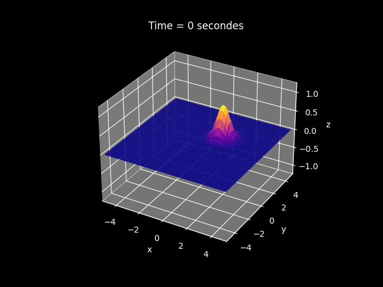

  # 2D-PDE-solver in C++
A code that **solve** 2D partial differential equations with **C++** and plot the whole thing with **matplotlib** (Python)


## exemples

- conduction **[heat equation]**



- wave **[wave equation]**


## languages

C++ for the calculation,

Python (with matplotlib) for the plotting

## installation and usage
1) **clone** the repo :

```
git clone https://github.com/nobody48sheldor/2D-PDE-solver-cpp
```

2. ***[Linux / BASH]*** 
- for linux users **run** the `compile-script.sh`

```
sh compile-script.sh
```

2. ***[Windows / Mac] for ohters (manually)***

- **compile** the `sovler.cpp`
- **run** the compiled file

## usefulness and pros

- You can **edit** the line that is used to calculate the next point to solve a lot of **2D-partial-differential** equation or even contribute, it is **fully open source.**

- It has been made so that it **doesn't take too much RAM** while beeing **user friendly** for contributing and using.

## cons
- **I am a highschool student** so it may not be the best way to make this kind of program since **I am not that experienced**.

- there are some **misscalculation at the boundaries**.

## contribute
- **You can contribute** to the code and **add** some differents **initial conditions** or **differential equation** and more like **complexity improuvement**.

